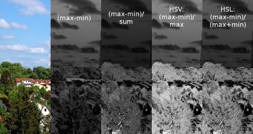
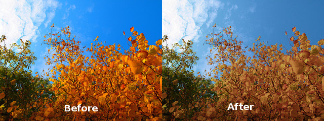

 # Calculate Saturation

This plugin calculates the saturation from a picture with four different saturation algorithms:
1. (max-min)
2. (max-min) / sum
3. like HSV: (max-min) / max
4. like HSL: (max-min) / (max+min)

Download here:  
https://github.com/elsamuko/gimp-elsamuko/tree/master/plugins/elsamuko-saturation

Build and install it with:

    gimptool-2.0 --install elsamuko-saturation.c

You'll find it then under **Colors → Components → Calc Saturation**.

Example:  

The resulting b/w image can be used as layer mask to filter saturation. For example the script elsamuko-naturalize below uses this plugin to give oversaturated images a more natural impression:  

If you like it, hug someone.
