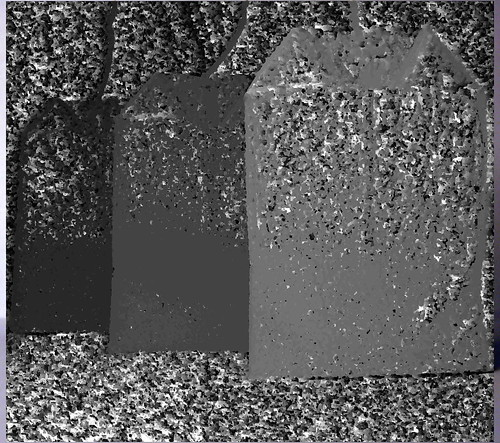

# Depthmap Plugin

This plugin generates a depthmap out of two stereoscopic images.
Install it with:

    gimptool-2.0 --install elsamuko-depthmap.c

Then open the two images as layers in GIMP and start the plugin under **Filters → Map → Depthmap**.
The two layers need to be identical in size.

The algorithm takes a pixel of the first layer plus its surrounding area and searches on the second layer for the best match.  
First option changes the horizontal parallax size the algorithm searches for a match. Try smaller values first, it's getting slow with big ones. Second option is the radius of the tile, which is compared to the tiles of the other image in the search area. Start here with small values too.  
This algorithm can't interpret the image content, so the results will be 'ugly' in digital noisy or under- or overexposed areas. Just try out.  

The depthmap can be used then e.g. in another plugin like focus blur to simulate a bigger aperture.

Examples [here](https://www.flickr.com/photos/28653536@N07/2928731453/) and [here](https://www.flickr.com/photos/28653536@N07/2922989392/).

The two layers conjoined to an anaglyph:  

The depthmap:  

