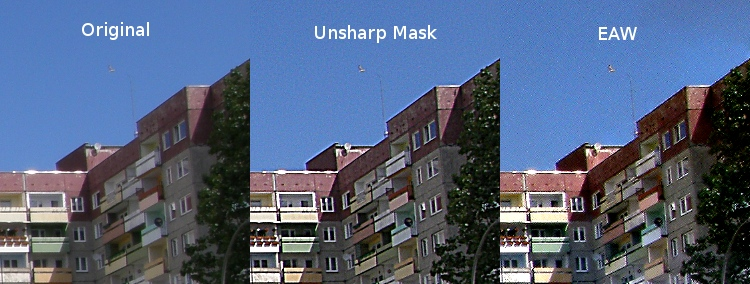

# EAW Sharpen Plugin

EAW Sharpen is a filter which sharpens an image without annoying halos. It's based on Mikes Python plugin:  
~~http://www.mm-log.com/blog/2010-04-05/gimp-edge-avoiding-wavelets~~

More info about the algorithm from Raanan Fattal:  
http://www.cs.huji.ac.il/~raananf/projects/eaw/index.html

To install the plugin, download and unzip the attachment, and type "make".
You will find the plugin then under **Filters → Enhance → EAW Sharpen**.

In the example image a strong sharpening has been applied with GIMP's Unsharp Mask and with EAW:

