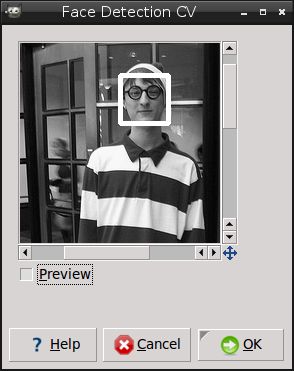

# Face Detection Plugin

This plugin detects faces in an input image, based on the example of the OpenCV wiki.  
Unzip the folder and type `make`, you need the `libcv-dev` and `libcvaux-dev` packets to compile the source code.  
You will find the plugin then under **Filters → Generic → Face Detection CV**.

