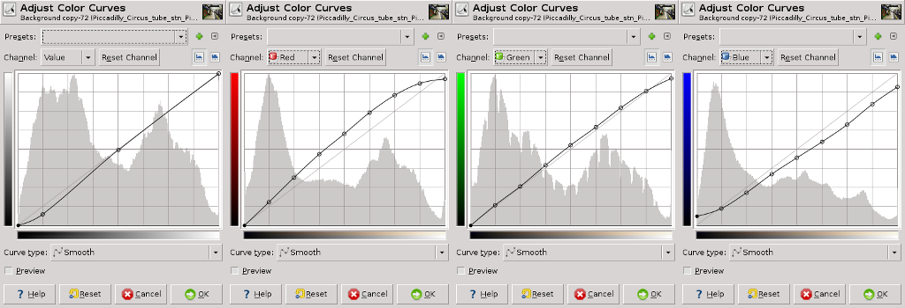
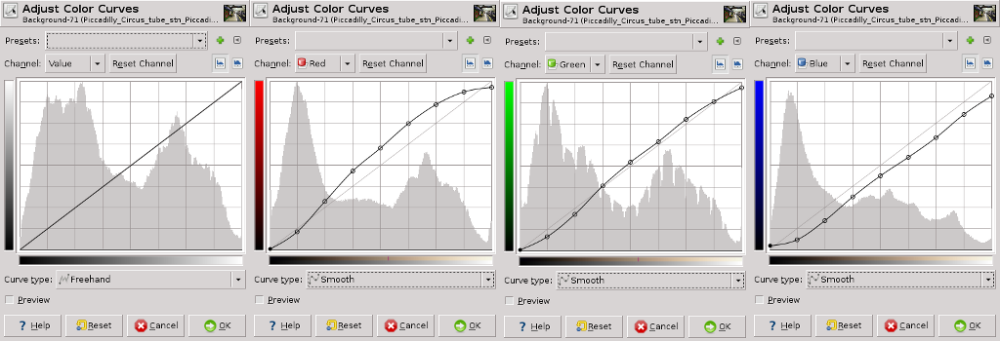

# Get Curves Plugin

This plugin calculates the color curve from two different pictures (Original and Modified).
Build and install it with:

    gimptool-2.0 --install elsamuko-get-curves.c

You'll find it then under **Colors → Get RGB Curves**.  
The plugin needs two images as two layers, the top layer is the modified one.  
The curve will be saved in GIMP's curves folder (curve_date_time) and can be opened by GIMP's color curve tool.  
Because the plugin calculates discrete values, the final curve may have some unwanted roots, which cause artifacts on the image, these can be removed with setting the curve type from freehand to smooth.

Original image:  

Applied curve:  

Modified image:  

Reconstructed curve:  

Reconstructed image:  

Result: The modified and the reconstructed image are virtually equal, which means, we reconstructed the curve successfully.
