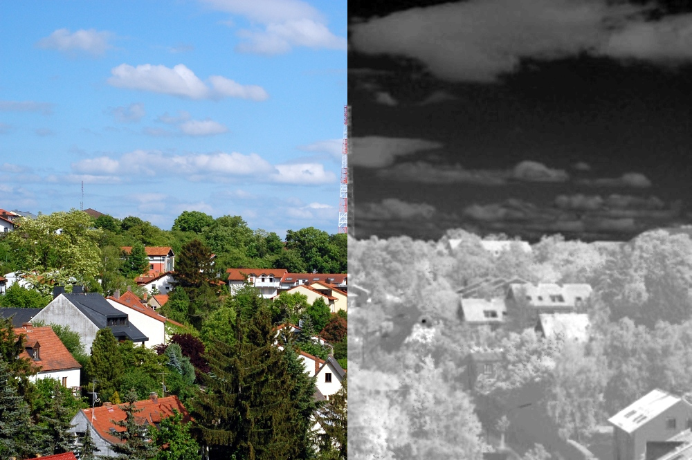

# Heatmap Plugin

This plugin calculates a heatmap from a picture.  
Build and install it with:

    gimptool-2.0 --install elsamuko-heatmap.c

You'll find it then under **Colors → Heatmap**.

The principle of this plugin is simple, it converts the image into the YUV color space and then rotates the U-V-coordinate system by 30°. Then it shifts and scales the resulting U-part to the common 0-255 range. The result is an image where warm colors become white and cold colors black. It can be used then as layer mask for other filter operations, e.g. if you want to apply a warming filter only to cold colors.

Example:  

