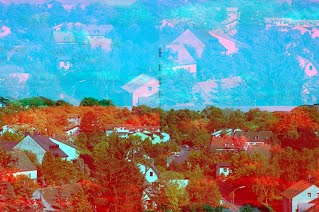

# GIMP Octave Plugin

This plugin provides a simple interface between GIMP and GNU Octave.
Means you can edit a picture from GIMP in the high level numerical language Octave:  
http://www.gnu.org/software/octave/

Download elsamuko-gimp-octave.c and install it with:

    gimptool-2.0 --install elsamuko-gimp-octave.c

You will find it then under **Filters → Mathematics → GIMP Octave**.
The input/output matrices and the Octave script are stored then in `~/.gimp-octave`.

For more interesting examples, download and unzip the filter pack in `~/.gimp-octave`.
The filter pack needs the octave-image package which should be available in your repository.
These are from here:  
http://www.csse.uwa.edu.au/~pk/Research/MatlabFns/index.html

Søren Hauberg modified the plugin to a version with included terminal:  
http://image.diku.dk/hauberg/gimp-octave-terminal/

For example in this image the red layer has been fft-shifted by Octave (needs 5-6 secs for a 1MP image):  

