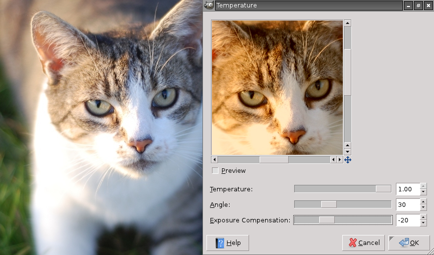

# YUV Temperature

This plugin changes the color temperature of an image via shifting it in the YUV color space:  
http://en.wikipedia.org/wiki/YUV

Compile and install it with:

    CC="g++ -O2" gimptool-2.0 --install elsamuko-temperature.c

Menu entry is **Colors → Color temperature**.

Example of a warm setting with lowered exposure:  

The YUV color space with the shift, the plugin does:  

