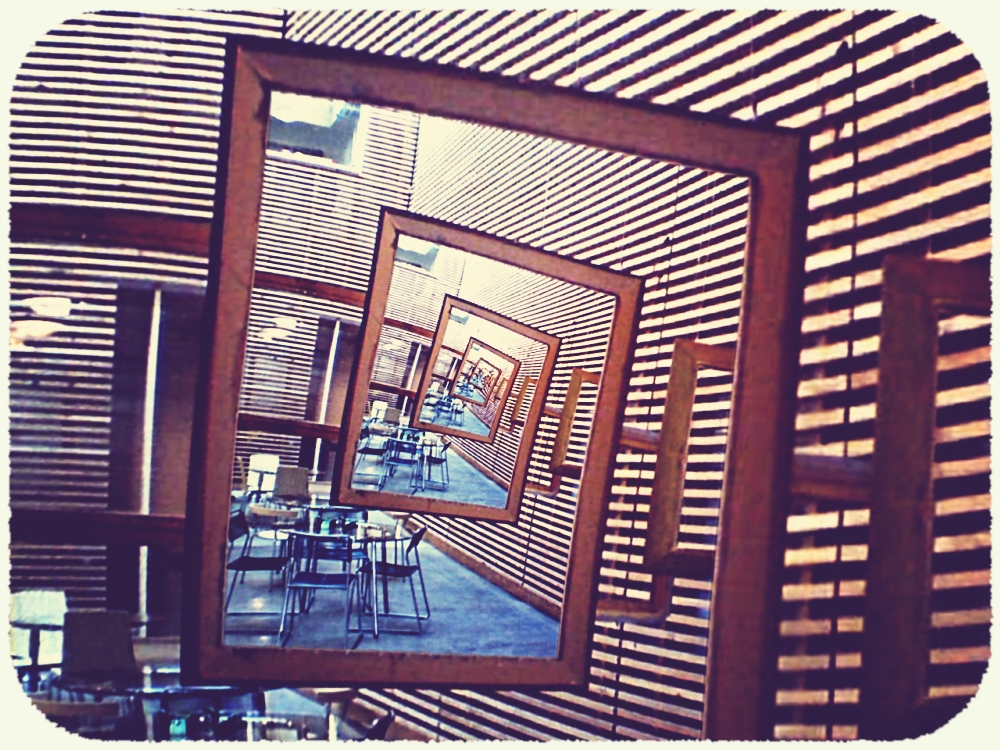

#  Antique Photo Border Script 

This script simulates a yellowed and slightly jagged border like these of old photographies.
Copy it into the [scripts folder](https://docs.gimp.org/2.10/en/install-script-fu.html) from GIMP, you will find it then under **Filters → Decor → Antique Photo Border**.

