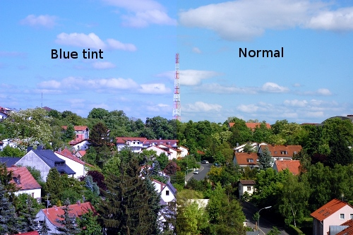

# Color Tint Script

This script filters one color and doubles it on top.  
Copy it into the [scripts folder](https://docs.gimp.org/2.10/en/install-script-fu.html) from GIMP, you will find it then under **Filters → Colors → Color Tint**.

