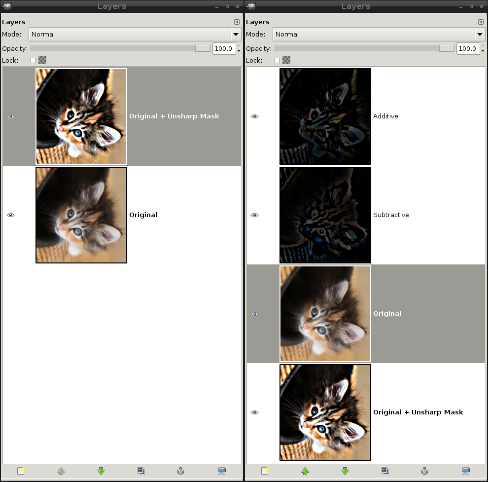

# Difference Layer Script

This script generates two difference layers from the two layers on the top, A is the original image layer, B the modified (e.g. sharpened) one on top:  

    A - B = C
    B - A = D
    A - C + D = B

It's similar to GIMP's built-in Grain Extract/Merge function, but the tonal range is bigger.  
Now you can apply further editing and "switch on/off" the difference by switching the visibility of the subtractive and the additive layer.  
Also you can change the modification intensity by changing the intensity of these two layers.

Copy it into the [scripts folder](https://docs.gimp.org/2.10/en/install-script-fu.html) from GIMP, you will find it then under **Layer → Difference Layers**.

Example image:

    Difference Layers
    Left: B A
    Right: D C A B

Thank you to Shelly and Roy from the Flickr GIMP group:
https://www.flickr.com/photos/shelly-and-roy/ 
