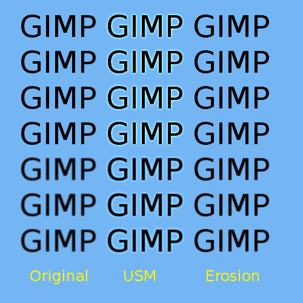

# Erosion Sharpen Script

This script sharpens an image with the built-in GIMP plugins erode and dilate.  
These two plugins infiltrate the image with the lowest/highest pixel of the closer environment, but never higher or lower.  
http://docs.gimp.org/en/plug-in-dilate.html  
http://docs.gimp.org/en/plug-in-erode.html  

This means, they can be used to sharpen an image w/out halos.

Copy it into the [scripts folder](https://docs.gimp.org/2.10/en/install-script-fu.html) from GIMP, you will find it then under **Filters → Enhance**.

Example:

If you like it, hug someone.
