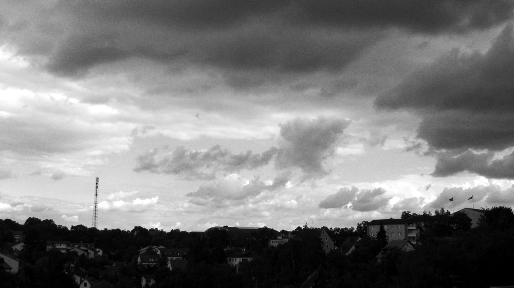

# Film Grain Script

This is a script which simulates the typical film grain of high ISO pictures. It's a script of [this tuorial](https://gimpguru.wordpress.com/Tutorials/FilmGrain/).  
Copy it into the [scripts folder](https://docs.gimp.org/2.10/en/install-script-fu.html) from GIMP, you will find it then under **Filters → Generic → Film Grain**.  
Holdness and Value are two options directly taken from HSV-Noise, Strength changes the amount and area of grey, which will turn grainy.  

It works together with colored and greyscaled pictures.
