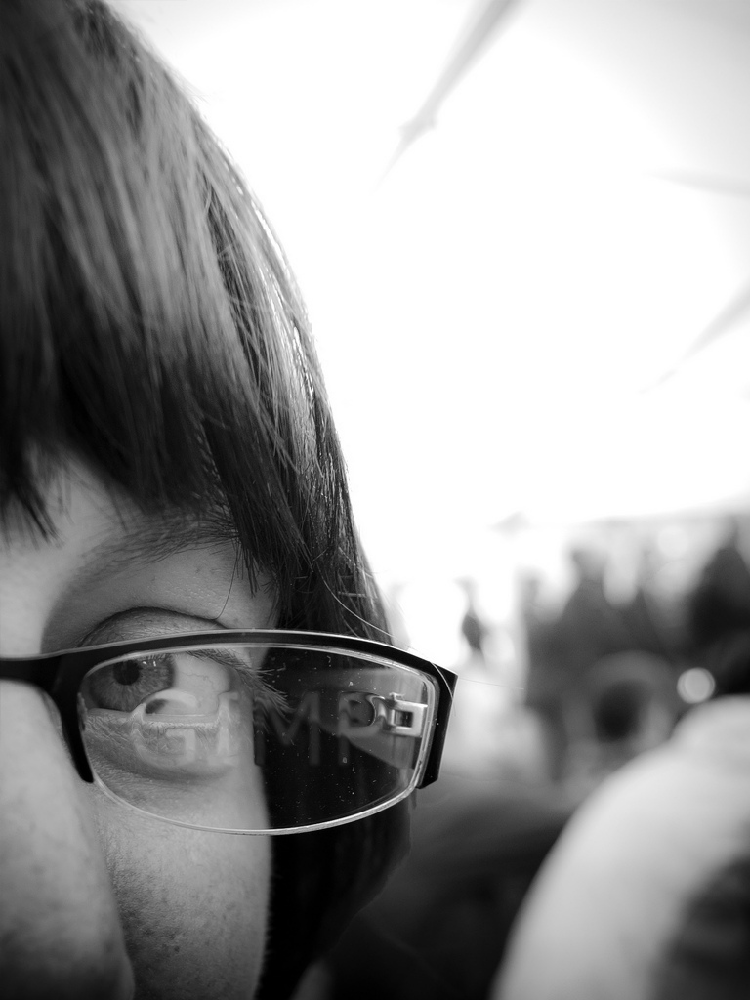

# Glass Displacement Script

Simple script which creates a glass gravure from two layers.  
Copy it into your [scripts folder](https://docs.gimp.org/2.10/en/install-script-fu.html), you'll find it then under **Filters → Distorts → Glass Displacement**.

If you like it, hug someone.

First layer:  

Second layer:  

Final gravure:  

