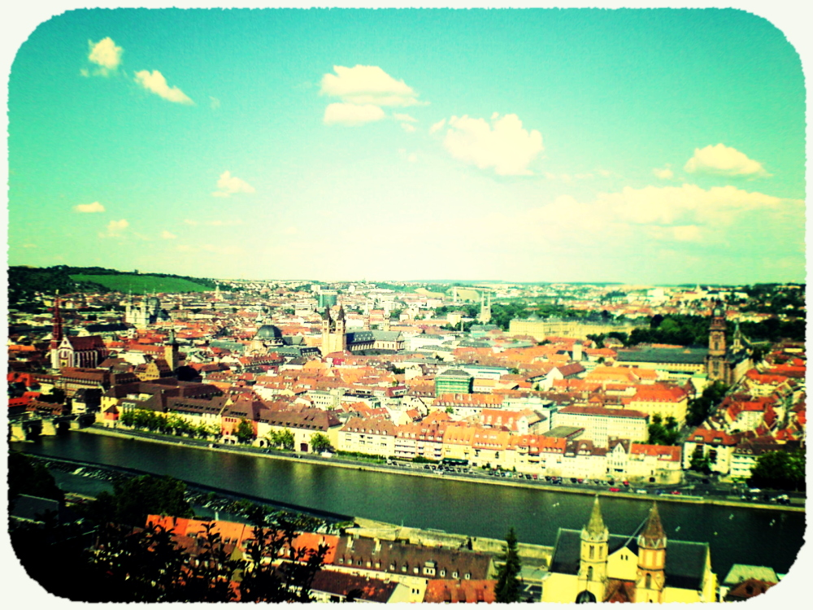
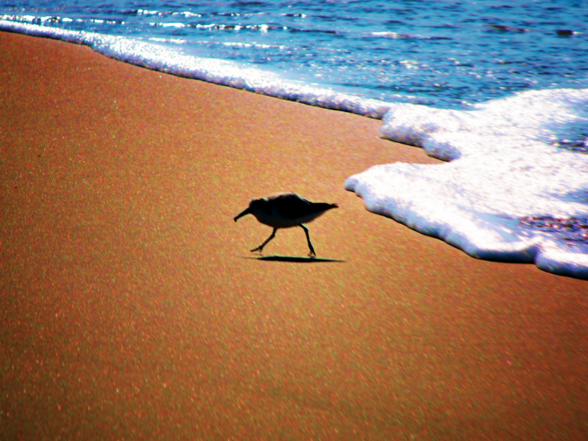
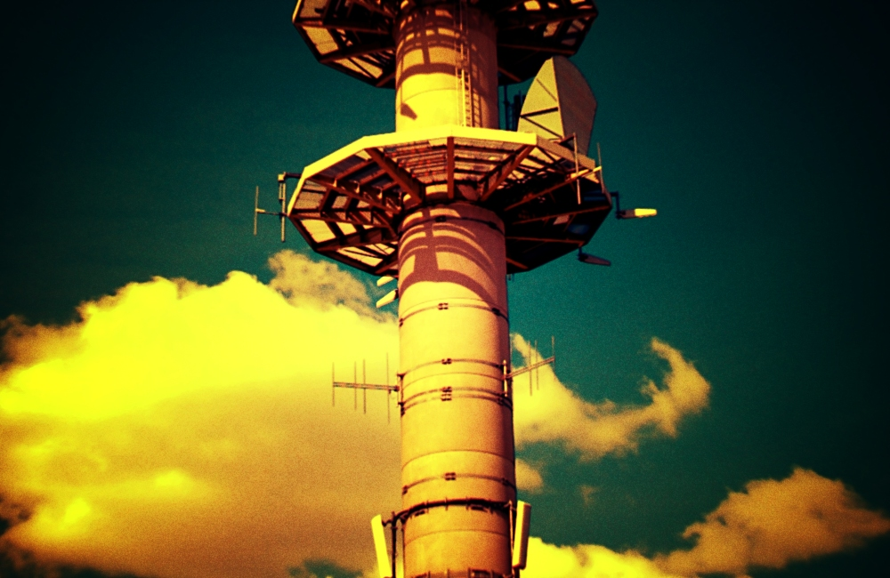

#  Lomo Script with Old Style Colors 

This script simulates the [Lomo](https://www.lomography.com/) effect. Copy it into the [scripts folder](https://docs.gimp.org/2.10/en/install-script-fu.html) from GIMP, you will find it then under **Filters → Light and Shadow → Lomo**.  
The original from Francois Le Lay can be downloaded [here](https://inphotos.org/2007/10/23/gimp-lomo-plugin/). The idea of C41 colors comes from [here](http://registry.gimp.org/node/4683). I added sharpness, repaired the double vignetting problem and added some nice colors, especially the beautiful green sky effect from Lomo pictures. Examples can be found [here](https://www.flickr.com/photos/28653536@N07/sets/72157606348593453/).  
Attention, results may make happy.

Updates:
* I [refreshed](blog.epicedits.com/2008/02/15/photoshop-techniques-cross-process-and-redscale/) the colors and added another vignette, but this is black and can be moved and resized.
* The overlayed vignettes are moving now with the black vignette. That means all vignettes have the same center.
* I added a slight lens distortion to simulate the wide angle lens of the Lomo LC-A. And if you own the grain script already, you can uncomment line 285 of this script to get a grainy black vignette automatically. Example here.
* New color "Autumn" to simulate [this](https://www.flickr.com/photos/drsquidd/2705603168/sizes/o/). To include vignette graininess, uncomment line 314. Result [here](https://flickr.com/photos/28653536@N07/2768350959/) and very impressive [here](https://www.flickr.com/photos/28653536@N07/2775866239/).
* I mixed the angle distortion up, now it bends to the right direction. And the source code became prettier thanks to [Dr. Scheme](https://racket-lang.org/).
* I added optional motion blur to simulate 'bad' lenses, see [here](https://www.flickr.com/photos/28653536@N07/2861262938/).
* Two new colors [Movie](https://www.domenlo.com/photoshop-tutorials/achieve-the-indie-movie-look/) and [Vintage](vintage). Also more decent sharpness with layer mask. And I included the grain for the black vignette, so you don't have to do this. Examples [here](https://www.flickr.com/photos/28653536@N07/2865573070/) and [here](https://www.flickr.com/photos/28653536@N07/2865573356/in/photostream/).
* New color Xpro LAB from [this book](http://www.photoshopforphotographers.com/pscs2/download/movie-06.pdf). Example [here](https://flickr.com/photos/28653536@N07/2891297169/).
* Possibility to inverse the A and B dimensions of the [LAB color space](http://en.wikipedia.org/wiki/Lab_color_space). Example [here](https://www.flickr.com/photos/28653536@N07/2986867427/).
* Fixed the b/w problem. Added a new color option Light Blue from [this](https://www.flickr.com/photos/darkensiva/2995235223/) role model. Example [here](https://www.flickr.com/photos/28653536@N07/3105995790/).
I also attached the colors I use. Extract and put them into the curves folder of GIMP.
* Lens distortion is adjustable now, the default is less extreme.
* New color Redscale from [here](http://blog.epicedits.com/2008/02/15/photoshop-techniques-cross-process-and-redscale/). Example [here](https://www.flickr.com/photos/28653536@N07/3789720321/). The Light Blue color now has a less violet tinge.
* Extensive internal fixes (eg. motion blur fixed). New option grain and gauss blur. Also sharpness is done via smart sharpen from eg and not overlay.
* Sharpness layer is better on top.
* Sharpness one down, grain deactivated while sharpening.
* Redscale is now closer to the physical approach. Example [here](https://www.flickr.com/photos/28653536@N07/4501441798/).
* Movie color option reworked, three new B/W tones: Retro, Paynes and Sepia. Example [here](https://www.flickr.com/photos/28653536@N07/4540513605/).
* Added batch version, run it with  
`gimp -i -b '(elsamuko-lomo-batch "picture.jpg" 1.5 10 10 0.8 5 1 3 128 0 FALSE FALSE TRUE FALSE 0 0 115)' -b '(gimp-quit 0)'`  
or for more than one picture  
`gimp -i -b '(elsamuko-lomo-batch "*.jpg" 1.5 10 10 0.8 5 1 3 128 0 FALSE FALSE TRUE FALSE 0 0 115)' -b '(gimp-quit 0)'`
Be careful, the batch script overwrites the original image. More info here:  
http://www.gimp.org/tutorials/Basic_Batch/
* Reduced vignette banding with the spread tool.
