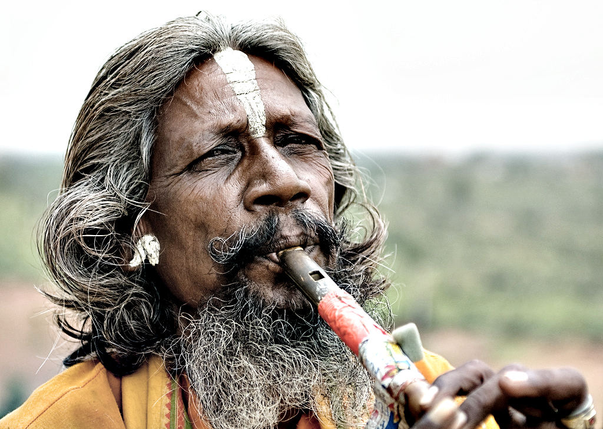

# National Geographic Script

This script simulates a high quality (portrait) photo like these from the National Geographic.
Copy it into the [scripts folder](https://docs.gimp.org/2.10/en/install-script-fu.html) from GIMP, you will find it then under **Filters → Generic → National Geographic**.  
Thanks to Martin Egger for the shadow revovery and the sharpen scripts, which I included in the script.  
Examples [here](https://www.flickr.com/photos/28653536@N07/2885742736/) and [here](https://www.flickr.com/photos/28653536@N07/2879128071/):

Updates:
* Added local contrast option.
* Optional inverted layer mask for brighter skin types.
* Added a batch version of this script, run it with  
`gimp -i -b '(elsamuko-national-geographic-batch "picture.jpg" 60 1 60 25 0.4 1 0)' -b '(gimp-quit 0)'`  
or for more than one picture  
`gimp -i -b '(elsamuko-national-geographic-batch "*.jpg" 60 1 60 25 0.4 1 0)' -b '(gimp-quit 0)'`  
Be careful, the batch script overwrites the original image. More info here:  
http://www.gimp.org/tutorials/Basic_Batch/
* Fix for the batch script, it merges now all layers before saving.
* Extensive internal fixes. Better defaults. And all edits are executed on extra layers.
* Batch script also updated.
* Two tinting options, red and blue.
