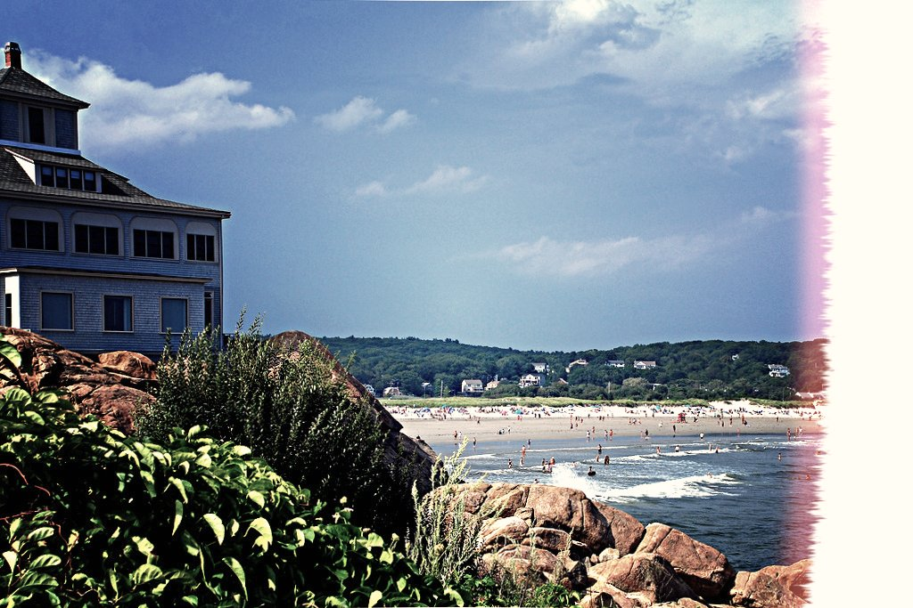

# First Photo Border Script

This script simulates the cut-off of the first picture of a film roll of cheap cameras like Lomo. Role model was [this picture from flickr](https://www.flickr.com/photos/conwayl/531028738/).  
Copy it into the [scripts folder](https://docs.gimp.org/2.10/en/install-script-fu.html) from GIMP, you will find it then under **Filters → Generic → Photo Border**.  
The 'Shift' option moves the cut-off-circle about a percentage of width. 'Radius' changes the size of this circle in multiples of height and 'Border Distance' the distance of the border in percentage of height. Just try some values and see the result.

An example can be seen here:  

