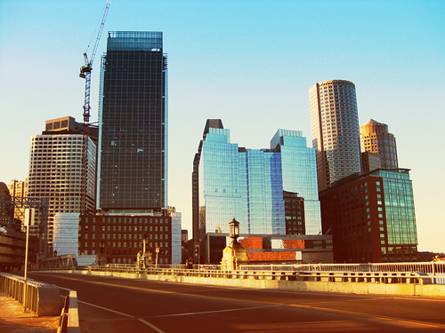
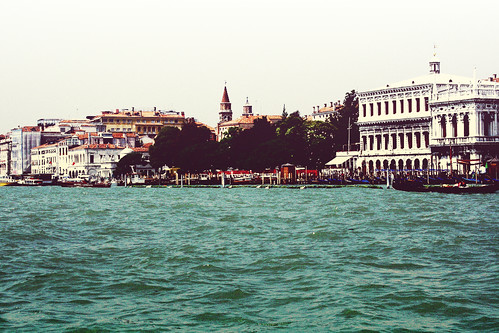

# Photochrom Script

This script simulates a photochrom image, a lithographic printing process from the 1890's:  
http://en.wikipedia.org/wiki/Photochrom  

The script is a translation of this how-to for PSE with some improvements:  
http://www.alibony.com/pse/031508postcard.html

Copy it into the [scripts folder](https://docs.gimp.org/2.10/en/install-script-fu.html) from GIMP, you will find it then under **Filters → Artistic → Photochrom**.

If you like it, hug someone.

Examples:

https://www.flickr.com/photos/28653536@N07/4390570531/  

https://www.flickr.com/photos/28653536@N07/4394791509/  

Updates:
* Slightly different contrast layers. New retro option which replaces the orange with a yellowish color. It's recommended to switch layers on for further edits (CTRL-L).
* Optional b/w dodging. It also deactivates the extra color layer. Thanks to Francois for the tip.
* Added a batch version of this script, run it with  
`gimp -i -b '(elsamuko-photochrom-batch "picture.jpg" (list 255 128 0) (list 255 68 112) 60 60 0 100 FALSE FALSE)' -b '(gimp-quit 0)'`  
or for more than one picture  
`gimp -i -b '(elsamuko-photochrom-batch "*.jpg" (list 255 128 0) (list 255 68 112) 60 60 0 100 FALSE FALSE)' -b '(gimp-quit 0)'`  
Be careful, the batch script overwrites the original image. More info here:
http://www.gimp.org/tutorials/Basic_Batch/
