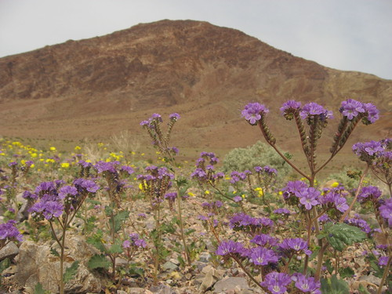
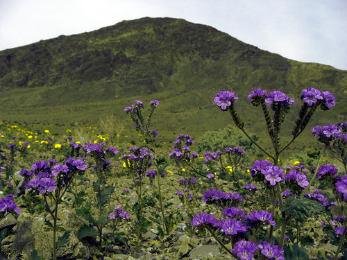

# Rainy Landscape Script

This script changes a dry landscape to a wet one. I scripted my tutorial from here:
https://www.flickr.com/groups/gimpusers/discuss/72157623477454455/

Copy it into the [scripts folder](https://docs.gimp.org/2.10/en/install-script-fu.html) from GIMP, you will find it then under **Filters → Light and Shadow → Rainy Landscape**.  
It doesn't have many options, because you can change them afterwards in the layers menu (CTRL-L).

If you like it, hug someone.

Before:  
https://www.flickr.com/photos/kenlund/3378248128/  

After:  
https://www.flickr.com/photos/28653536@N07/4426160982/  

