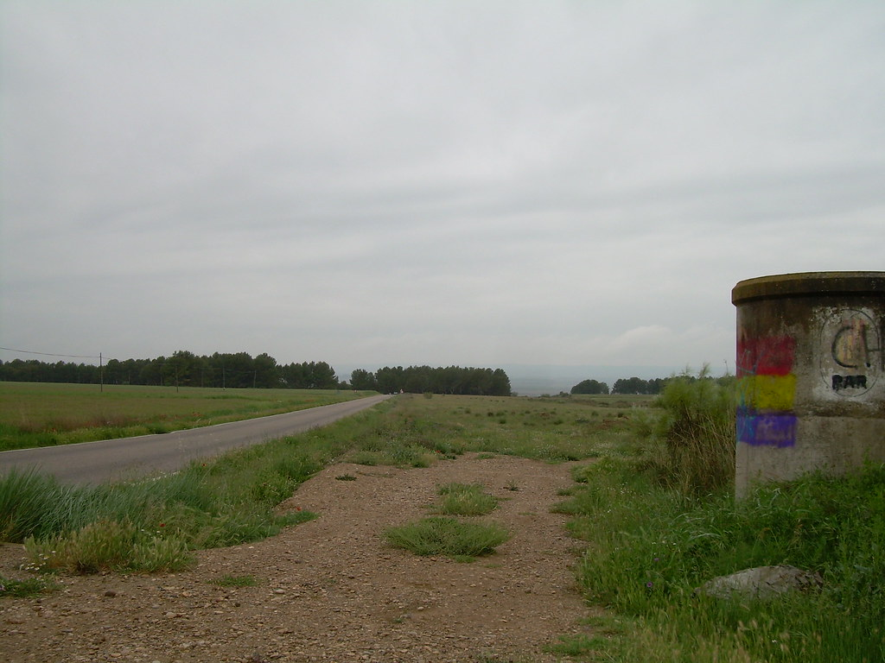
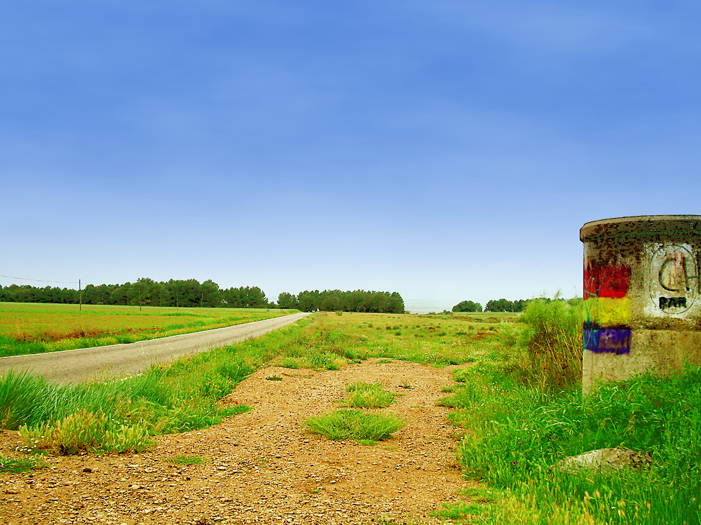

# Sunny Landscape Script

This script changes a rainy landscape to a sunny one.

Copy it into the [scripts folder](https://docs.gimp.org/2.10/en/install-script-fu.html) from GIMP, you will find it then under **Filters → Light and Shadow → Sunny Landscape**.

If you like it, hug someone.

Before:  
https://www.flickr.com/photos/srgblog/2477297713/  

After:  
https://www.flickr.com/photos/28653536@N07/4477835346/  

