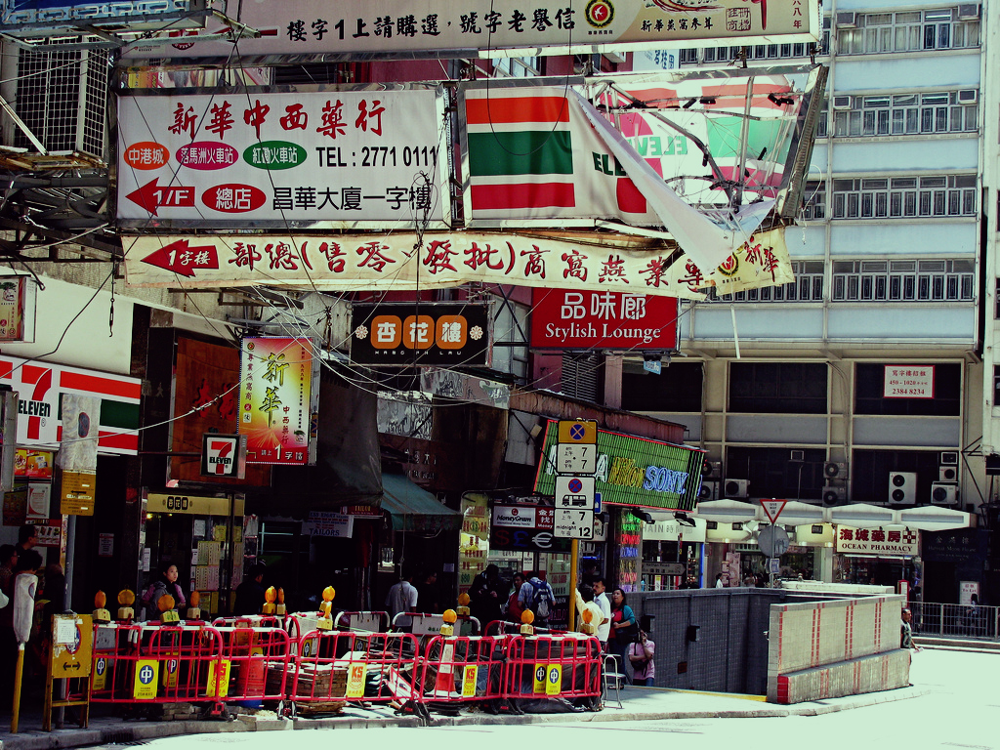

# Technicolor 3 Color Script

This script simulates the [3 Color Technicolor](http://en.wikipedia.org/wiki/Technicolor#Three-strip_Technicolor) effect.

Copy it into the [scripts folder](https://docs.gimp.org/2.10/en/install-script-fu.html) from GIMP, you will find it then under **Colors → Technicolor 3 Color**.

Example [here](https://www.flickr.com/photos/28653536@N07/2853315748/):  

Updates:
* The sharpness layer got an inverted layer mask.
* I kicked the additional multiply layers out and set better default values (now R = 2R - 1/2 (B + G)).
* Values back to 1.2R. New retro colors option. Example [here](https://www.flickr.com/photos/28653536@N07/3525392115/).
* Optional extra color layer.

See also the Technicolor 2 Color Script.
