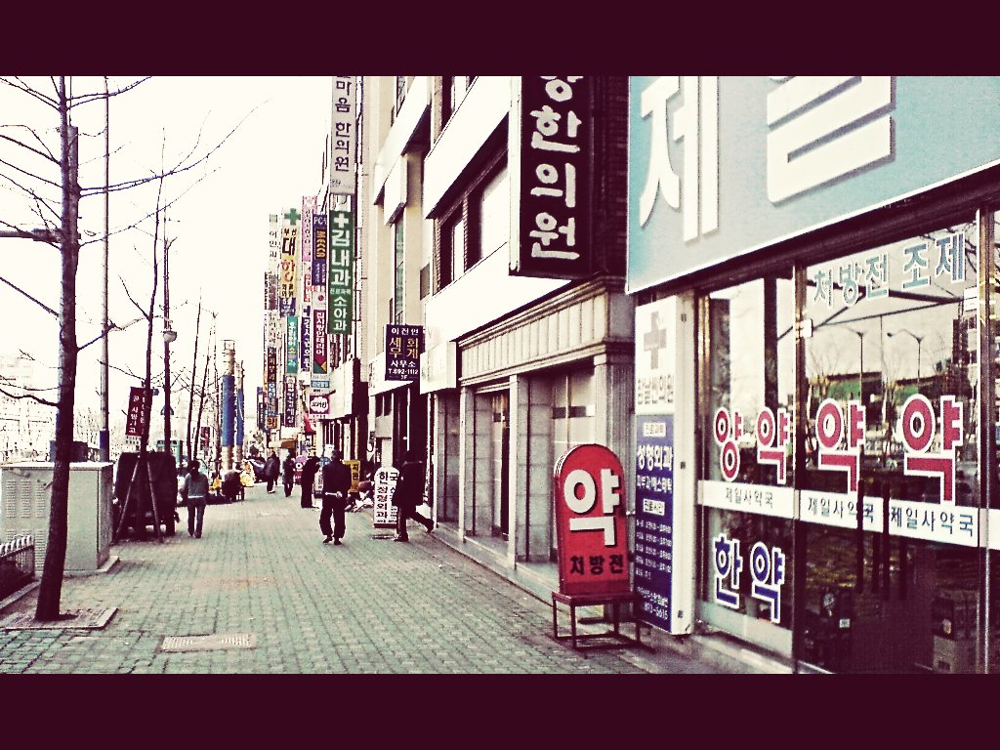

# Vintage Look Script

This script simulates a [70s vintage look](https://crazymurdock1.deviantart.com/art/Vintage-look-in-Gimp-61841683).

Copy it into the [scripts folder](https://docs.gimp.org/2.10/en/install-script-fu.html) from GIMP, you will find it then under **Filters → Artistic → Vintage Look**.

