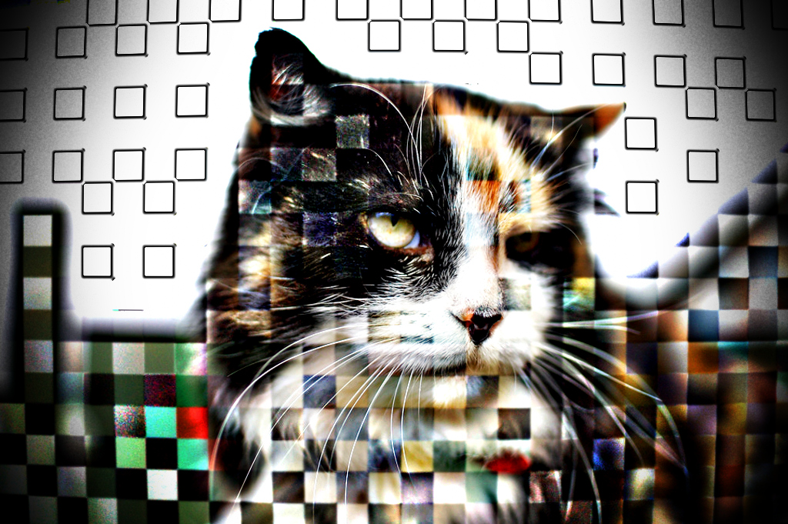

# White Balance Puzzle Script

This script creates small rectangular selections and auto-white-balances them.
Copy it into the scripts folder from GIMP, you will find it then under Filters -> Light and Shadow -> White Balance Puzzle.

Be careful with the feather option, it consumes a lot of cpu power. 
This script gives a strange [result](https://www.flickr.com/photos/28653536@N07/2845585028/), so it just fits in rare conditions:

I'm using it for image analysis. It "detects" image edits in low contrast areas.
